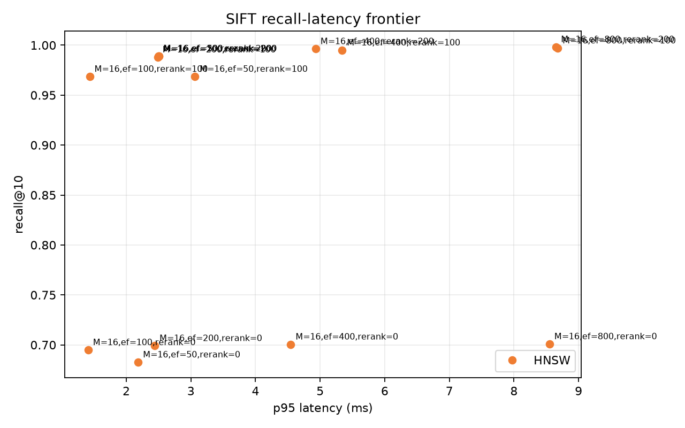

# VectorDB from Scratch


A vector search engine implemented directly in Python and NumPy, without
FAISS, hnswlib, scikit-learn, or another ANN library.

The project implements exact search, HNSW, product quantization, HNSW+PQ, and
disk-backed IVF+PQ. The main focus is measured behavior: recall, latency,
construction time, memory, and storage at scales from unit tests to 25 million
vectors.

> This is an educational systems project, not a production replacement for
> FAISS, Qdrant, Pinecone, or Weaviate. All comparisons below are between this
> project's implementations on the same M3 Pro—not cross-library claims.

## Main result: HNSW+PQ versus disk IVF+PQ

Both indexes were built over all one million SIFT base vectors and evaluated
with all 10,000 official queries using squared L2 distance.

| Metric | HNSW+PQ | Disk IVF+PQ |
|---|---:|---:|
| Configuration | `M=16`, `ef=100`, rerank 100 | `nlist=4096`, budget 20k, rerank 100 |
| PQ | Standard, `m=32` | Residual, `m=32` |
| Recall@1 | 0.9738 | **0.9782** |
| Recall@10 | 0.9686 | **0.9701** |
| p50 | **1.30 ms** | 9.37 ms |
| p95 | **1.43 ms** | 13.40 ms |
| p99 | **1.51 ms** | 14.69 ms |
| QPS | **783.23** | 104.05 |
| Average nodes / records examined | **1,772.6** | 20,253.5 |
| Training time | **8.55 s** | 11.57 s |
| Build time | 2,812.15 s | **10.67 s** |
| Build throughput | 355.6 vectors/s | **93,729 vectors/s** |
| Resident index structures | 183.0 MiB | **4.25 MiB** |
| Index size with raw vectors | 656.9 MiB | **534.1 MiB** |

At approximately equal recall, HNSW produced 7.2× lower median latency, 9.3×
lower p95 latency, and 7.5× higher QPS. IVF built 264× faster and kept 43×
fewer index-structure bytes resident.

This is the central result:

- **HNSW+PQ** is the low-latency choice while its graph fits in memory.
- **Disk IVF+PQ** is the fast-build, bounded-memory choice when the corpus
  outgrows RAM.

The saved HNSW graph was reloaded and produced identical recall. Its reload
run measured 1.31 ms p50 and 1.83 ms p95, showing normal mmap/page-cache
variation without a correctness change.



### Recall and reranking

Exact shortlist reranking was essential for compressed HNSW:

| HNSW setting | Recall@10 | p95 |
|---|---:|---:|
| `ef=100`, no reranking | 0.6950 | 1.41 ms |
| `ef=100`, rerank 100 | 0.9686 | 1.43 ms |
| `ef=200`, rerank 100 | 0.9880 | 2.49 ms |
| `ef=400`, rerank 200 | 0.9963 | 4.93 ms |
| `ef=800`, rerank 200 | 0.9983 | 8.65 ms |

Increasing `ef_search` to 800 without reranking reached only 0.7009 recall.
The graph was finding useful candidates; lossy PQ was misordering them.

## 25-million-vector scale test

The disk IVF+PQ engine was also tested on 25 million deterministic synthetic
64-dimensional vectors.

| Metric | Result |
|---|---:|
| Configuration | `nlist=20,000`, `nprobe=1,000`, PQ `m=16` |
| Training / build / compaction | 62.6 / 350.5 / 4.2 s |
| Build throughput | **71,331 vectors/s** |
| Packed query latency | **141.5 ms** |
| Recall@10 with exact top-100 reranking | **0.833** |
| Resident index structures | 10.4 MiB |
| Index size with raw vectors | 6.71 GiB |

Only three exact queries were used for recall because ground truth requires a
full scan of all 25 million vectors. Treat this as a scale checkpoint, not a
statistically complete recall evaluation.

### Measured engineering progression

| Change | Before | After |
|---|---:|---:|
| Scalar to batched IVF ingestion | 1,959 vec/s | 40,821 vec/s |
| MLX routing on the 25M build | 40,821 vec/s | **71,331 vec/s** |
| Per-cluster reads to packed mmap | 248.9 ms | **141.5 ms** |
| PQ-only to exact top-100 reranking | 0.500 recall@10 | **0.833** |

## What is implemented

| Component | Purpose |
|---|---|
| Exact brute force | Ground truth for every ANN evaluation |
| HNSW | Multilayer graph search |
| Product quantization | Configurable learned vector compression |
| HNSW+PQ | Compact `int32` graph, batch encoding, persistence, exact reranking |
| IVF+PQ | Disk postings, residual PQ, candidate budgets, streaming top-N |
| Packed storage | One mmap segment plus appendable delta files |
| MLX routing | Optional Apple GPU acceleration during IVF ingestion |
| FastAPI service | Persistent named IVF collections over HTTP |

Both approximate indexes support an optional `raw_vectors.f32` sidecar. PQ
selects a small shortlist; exact squared-L2 distance over those original
vectors produces the final ranking.

## Quick start

```bash
git clone https://github.com/Kshitijmishradev/VectorDB.git
cd VectorDB

python3 -m venv venv
source venv/bin/activate
pip install -r requirements-dev.txt
python3 -m pytest
```

Minimal IVF example:

```python
import numpy as np
from vectordb.ivf_pq import IVFPQIndex

rng = np.random.default_rng(0)
vectors = rng.random((10_000, 64), dtype=np.float32)
ids = np.arange(len(vectors), dtype=np.int64)

index = IVFPQIndex(
    64, nlist=256, pq_m=16,
    storage_dir="./ivf_storage/example",
    pq_mode="residual", store_full_vectors=True,
)
index.train(vectors[:8_000], n_iters=10)
index.add_batch(vectors, ids)
index.compact()

found_ids, distances = index.search(
    vectors[0], k=10, max_candidates=2_000, rerank=100)
index.close()
```

Start the REST API with `python3 run_api.py`; interactive documentation is at
[`http://localhost:8000/docs`](http://localhost:8000/docs).

## Reproduce the results

Install the benchmark dependencies:

```bash
pip install -r requirements-bench.txt
```

IVF SIFT1M:

```bash
python3 benchmarks/bench_sift1m.py --download --final --preset optimized
```

HNSW SIFT1M—the build takes roughly 47 minutes on the measured M3 Pro:

```bash
python3 benchmarks/bench_sift1m.py \
  --index hnsw --comparison controlled --final \
  --M 16 --ef-construction 200 --pq-m 32 \
  --pq-train-size 100000 --train-iters 10 \
  --ef-search-values 50,100,200,400,800 \
  --rerank-values 0,100,200 \
  --storage-root /tmp/vectordb_sift_hnsw_1m \
  --keep-storage \
  --json results/sift_hnsw_1m.json \
  --csv results/sift_hnsw_1m.csv \
  --chart results/sift_hnsw_1m.png
```

After that build, add `--reuse-index` to run new query sweeps without building
the graph again.

The 25M benchmark requires approximately 6.71 GiB for the completed index:

```bash
python3 bench_ivf.py 25000000 \
  --nlist 20000 --nprobe 1000 \
  --train-minibatch-size 200000 --pq-train-size 200000 \
  --routing-backend mlx --pq-mode residual --rerank 100 \
  --progress-every 1000000 --recall-queries 3 \
  --compare-unpacked-query --keep-storage \
  --json results/benchmark_25m_rerank_mlx.json
```

## Evidence

- [Final IVF SIFT1M JSON](./results/sift1m_final.json)
- [Full HNSW SIFT1M frontier](./results/sift_hnsw_1m.json)
- [HNSW SIFT1M CSV](./results/sift_hnsw_1m.csv)
- [HNSW terminal log](./results/sift_hnsw_1m.log)
- [25M IVF result](./results/benchmark_25m_rerank_mlx.json)
- [NumPy versus MLX routing](./results/gpu_routing_benchmark.json)
- [Chronological engineering log](./RESULTS.md)

## Limitations

- HNSW construction is sequential Python and much slower than batched IVF.
- Individual vector update and deletion are not implemented.
- Collection writes assume a single writer.
- Metadata filtering and authentication are not implemented.
- MLX accelerates IVF ingestion routing, not query execution.
- CIFAR-100/CLIP tooling exists, but its full benchmark is not published.
