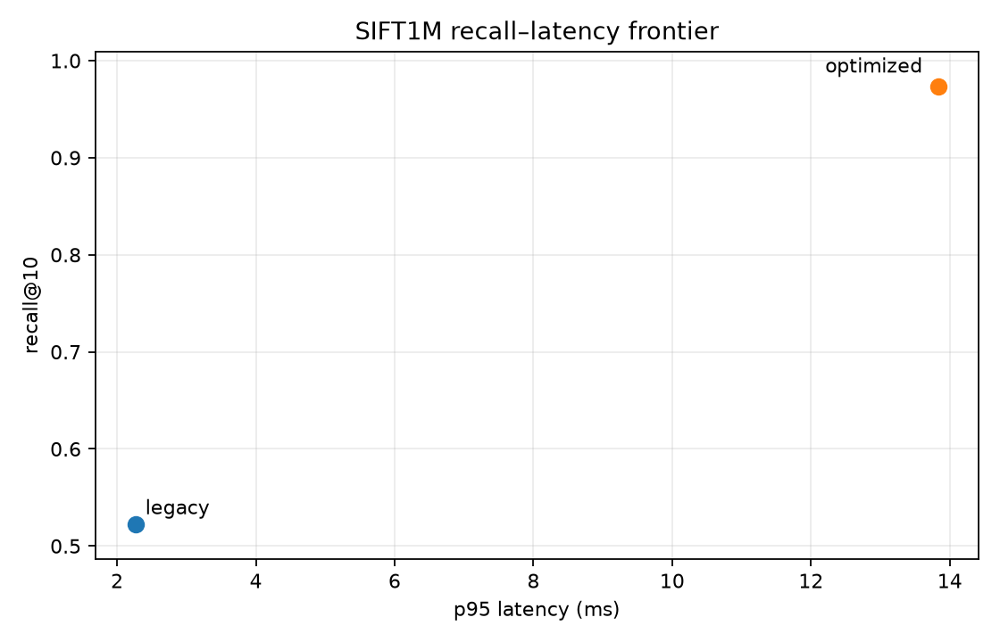
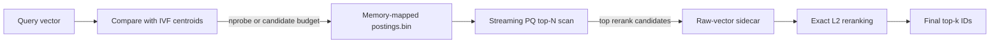

# VectorDB from Scratch


A disk-backed approximate-nearest-neighbor database implemented directly in
Python and NumPy—without FAISS, hnswlib, scikit-learn, or another ANN library.

The repository builds the search stack one layer at a time: exact search,
HNSW, product quantization, compact persistent HNSW+PQ, and finally a
disk-backed IVF+PQ index with batched ingestion, residual product quantization,
candidate-budget routing, streaming top-N scans, exact shortlist reranking, a
REST API, and optional Apple Silicon GPU routing through MLX.

> This is an educational systems project with real persistence, tests, and
> large-scale measurements. It is not presented as a production replacement
> for FAISS, Qdrant, Pinecone, or Weaviate.

[25M result](#25-million-vector-result) · [SIFT1M](#sift1m-real-data-result) · [Architecture](#architecture) ·
[Quick start](#quick-start) · [API](#rest-api) ·
[Benchmarks](#reproducing-the-benchmarks) · [Limitations](#current-limitations)

## 25-million-vector result

Measured locally on a MacBook Pro with an M3 Pro and 18 GB unified memory:

| Metric | Result |
|---|---:|
| Vectors | 25,000,000 |
| Dimensions | 64 (`float32`) |
| IVF configuration | `nlist=20,000`, `nprobe=1,000` |
| PQ configuration | `m=16`, 16-byte code |
| Training time | 62.6 s |
| Build time | 350.5 s |
| Build throughput | **71,331 vectors/s** |
| Compaction time | 4.2 s |
| Total indexing time | 417.3 s |
| Packed query latency | **141.5 ms** |
| Unpacked query latency | 248.9 ms |
| Packed-read speedup | **1.76×** |
| Recall@10 with exact top-100 reranking | **0.833** |
| Resident index structures | 10.4 MiB |
| Final index size with raw vectors | 6.71 GiB |

The full machine-readable result is in
[`results/benchmark_25m_rerank_mlx.json`](./results/benchmark_25m_rerank_mlx.json).

The recall value above uses three exact full-dataset queries because computing
ground truth requires scanning all 25 million vectors. Treat it as a measured
large-scale checkpoint, not a statistically complete ANN evaluation. The
benchmark uses deterministic uniformly distributed synthetic vectors and
squared L2 distance; comparisons with other projects are meaningful only when
the dataset, hardware, and quality target are also comparable.

### Performance progression

| Engineering stage | Measured result |
|---|---:|
| Scalar insertion path, 10M run | 1,959 vectors/s |
| Batched NumPy insertion, 25M run | 40,821 vectors/s |
| Batched insertion + MLX routing, 25M run | **71,331 vectors/s** |
| Per-cluster query files | 248.9 ms/query |
| Packed memory-mapped postings | **141.5 ms/query** |
| PQ-only recall@10 at 25M | 0.500 |
| Exact top-100 reranked recall@10 at 25M | **0.833** |

MLX accelerates coarse routing during ingestion only. Query execution remains
on the CPU. At the representative `100,000 × 20,000 × 64` routing shape, MLX
matched every NumPy assignment and made that stage 2.96× faster. See
[`results/gpu_routing_benchmark.json`](./results/gpu_routing_benchmark.json).

## SIFT1M real-data result

Measured on the same M3 Pro using the official ANN-Benchmarks SIFT1M dataset.
The final run uses every one of the 10,000 supplied queries, with each query
executed independently after five warm-ups.

| Metric | Optimized result |
|---|---:|
| Base vectors / dimensions | 1,000,000 / 128 |
| Configuration | `nlist=4096`, residual PQ `m=32` |
| Candidate budget / rerank | 20,000 / 100 |
| Average candidates scanned | 20,253.5 |
| Recall@1 | **0.9782** |
| Recall@10 | **0.9701** |
| First query | 12.48 ms |
| Warm p50 / p95 / p99 | **9.37 / 13.40 / 14.69 ms** |
| QPS | 104.05 |
| Train / build / compact | 11.57 / 10.67 / 0.30 s |
| Index size | 534.1 MiB |
| Resident index structures | 4.25 MiB |

This passes the project target of recall@10 ≥ 0.80, p50 ≤ 75 ms, and
p95 ≤ 100 ms. On the 200-query matched-data comparison, the legacy standard
PQ configuration reached 0.5225 recall@10 at 2.26 ms p95, while residual PQ
with exact top-100 reranking reached 0.9735 at 13.84 ms p95. These are
within-project, same-hardware measurements—not cross-library claims.



Machine-readable results are in
[`results/sift1m.json`](./results/sift1m.json) and
[`results/sift1m_final.json`](./results/sift1m_final.json).

### HNSW+PQ versus disk IVF+PQ

The compact HNSW+PQ implementation was also built over all one million base
vectors and evaluated with all 10,000 queries. Its selected configuration was
`M=16`, `ef_construction=200`, standard PQ `m=32`, `ef_search=100`, and exact
top-100 reranking. The comparison below uses each engine's best measured
configuration on the same dataset and M3 Pro; IVF uses residual PQ while HNSW
uses standard PQ, so this is an end-to-end system comparison rather than an
isolated quantizer experiment.

| Metric | HNSW+PQ | Disk IVF+PQ |
|---|---:|---:|
| Recall@1 | 0.9738 | **0.9782** |
| Recall@10 | 0.9686 | **0.9701** |
| Warm p50 | **1.30 ms** | 9.37 ms |
| Warm p95 | **1.43 ms** | 13.40 ms |
| Warm p99 | **1.51 ms** | 14.69 ms |
| QPS | **783.23** | 104.05 |
| Average graph nodes / posting records examined | **1,772.6** | 20,253.5 |
| Training time | **8.55 s** | 11.57 s |
| Build time | 2,812.15 s | **10.67 s** |
| Build throughput | 355.6 vectors/s | **93,729 vectors/s** |
| Resident index structures | 183.0 MiB | **4.25 MiB** |
| Total index size with raw vectors | 656.9 MiB | **534.1 MiB** |

At approximately matched recall, HNSW delivered 7.2× lower median latency,
9.3× lower p95 latency, and 7.5× higher QPS. IVF built 264× faster and used
about 43× fewer resident index-structure bytes. This is the architecture
boundary the project set out to demonstrate: HNSW is the low-latency option
while its graph fits in memory; disk IVF is the fast-build, bounded-memory
path when the corpus outgrows RAM.

Exact reranking was essential for compressed HNSW. At `ef_search=100`, recall
rose from 0.6950 without reranking to 0.9686 with top-100 reranking. A
higher-recall setting (`ef_search=200`, rerank 100) reached 0.9880 recall@10 at
2.49 ms p95, while `ef_search=400`, rerank 200 reached 0.9963 at 4.93 ms p95.

The persisted one-million-vector graph was reloaded and returned identical
recall@1/10. The reload run measured 1.31 ms p50 and 1.83 ms p95, illustrating
the expected mmap/page-cache variation without changing search correctness.


The complete HNSW frontier and terminal log are in
[`results/sift_hnsw_1m.json`](./results/sift_hnsw_1m.json),
[`results/sift_hnsw_1m.csv`](./results/sift_hnsw_1m.csv), and
[`results/sift_hnsw_1m.log`](./results/sift_hnsw_1m.log). These are
within-project, same-hardware results—not cross-library performance claims.

## Architecture



The final index is an IVFADC-style pipeline:

1. **IVF routing** assigns each vector to its nearest coarse centroid.
2. **Product quantization** compresses a 64-dimensional float vector from
   256 bytes to a 16-byte code when `pq_m=16`. Optional residual PQ encodes
   `vector - assigned_centroid`, reducing quantization error inside each list.
3. **Posting lists** store IDs and PQ codes on disk instead of retaining the
   dataset in Python objects.
4. **Compaction** merges per-cluster files into one offset-indexed,
   memory-mapped `postings.bin`, eliminating one file open per probed cluster.
5. **Streaming ADC search** evaluates one bounded posting chunk at a time and
   retains only the global top-N, avoiding candidate-sized concatenations and
   PQ contribution matrices.
6. **Optional reranking** fetches only a small shortlist from
   `raw_vectors.f32` and computes exact L2 distances before returning top-k.

New inserts after compaction are written to small delta files. Running
`compact()` again merges those deltas into a new immutable posting segment.

### Algorithms implemented

| Component | Source | Purpose |
|---|---|---|
| Exact brute force | `vectordb/brute_force.py` | Ground truth and correctness baseline |
| HNSW | `vectordb/hnsw.py` | Graph-based approximate search |
| Product Quantization | `vectordb/pq.py` | Learned lossy vector compression |
| HNSW + PQ | `vectordb/hnsw_pq.py` | Compact persistent graph, compressed search, exact reranking |
| IVF + PQ | `vectordb/ivf_pq.py` | Disk-backed large-scale index |
| MLX routing | `vectordb/mlx_routing.py` | Optional Apple GPU ingestion backend |
| REST service | `vectordb/api.py` | Persistent named collections over HTTP |

## Features

- Exact and approximate nearest-neighbor search using squared L2 distance.
- Streaming, batched ingestion with bounded working memory.
- NumPy/BLAS CPU routing and optional MLX/Metal routing on Apple Silicon.
- PQ compression with configurable subspace count.
- Compact array-backed HNSW+PQ with batched encoding and persistent reload.
- Standard and residual PQ modes with metadata-v3 persistence.
- Candidate-budget routing for comparable scans across different `nlist` values.
- Streaming top-N search with bounded query working memory.
- Packed, offset-indexed, memory-mapped posting lists.
- Exact top-N reranking backed by a raw-vector sidecar.
- Persistent save/load with continued insertion after restart.
- Named collections exposed through FastAPI.
- Deterministic benchmark generation and exact recall measurement.
- Unit and integration coverage for every index stage.

## Quick start

```bash
git clone https://github.com/Kshitijmishradev/VectorDB.git
cd VectorDB

python3 -m venv .venv
source .venv/bin/activate
pip install -r requirements-dev.txt

python3 -m pytest
```

`mlx` is installed only on Apple Silicon through the environment marker in
`requirements.txt`. Use `routing_backend="numpy"` everywhere else.

### Use the index from Python

```python
import numpy as np

from vectordb.ivf_pq import IVFPQIndex

rng = np.random.default_rng(0)
vectors = rng.random((10_000, 64), dtype=np.float32)
ids = np.arange(len(vectors), dtype=np.int64)

index = IVFPQIndex(
    dim=64,
    nlist=256,
    pq_m=16,
    storage_dir="./data/example",
    store_full_vectors=True,
    routing_backend="numpy",  # use "mlx" on Apple Silicon
    pq_mode="residual",
)

index.train(vectors[:8_000], n_iters=10)
index.add_batch(vectors, ids)
index.compact()
index.save()

query = rng.random(64, dtype=np.float32)
neighbor_ids, squared_l2 = index.search(
    query,
    k=10,
    max_candidates=2_000,
    rerank=100,
)

print(neighbor_ids)
print(squared_l2)
index.close()
```

Reload the same index without retraining:

```python
index = IVFPQIndex.load("./data/example")
neighbor_ids, distances = index.search(
    query, k=10, max_candidates=2_000, rerank=100)
index.close()
```

## REST API

Start the local server:

```bash
python3 run_api.py
```

Interactive OpenAPI documentation is available at
[`http://localhost:8000/docs`](http://localhost:8000/docs).

Example collection lifecycle:

```bash
# Create an exact-rerank-capable collection.
curl -X POST http://localhost:8000/collections/products \
  -H 'Content-Type: application/json' \
  -d '{
    "dim": 4,
    "nlist": 2,
    "pq_m": 2,
    "pq_k": 4,
    "store_full_vectors": true,
    "routing_backend": "numpy",
    "pq_mode": "residual"
  }'

# Train using a representative vector sample.
curl -X POST http://localhost:8000/collections/products/train \
  -H 'Content-Type: application/json' \
  -d '{
    "vectors": [
      [0.0, 0.0, 0.0, 0.0],
      [1.0, 1.0, 1.0, 1.0],
      [0.0, 1.0, 0.0, 1.0],
      [1.0, 0.0, 1.0, 0.0]
    ]
  }'

# Add vectors and their external IDs.
curl -X POST http://localhost:8000/collections/products/vectors \
  -H 'Content-Type: application/json' \
  -d '{
    "ids": [101, 102],
    "vectors": [[0.1, 0.2, 0.3, 0.4], [0.8, 0.7, 0.9, 0.6]]
  }'

# Pack postings, then search with exact shortlist reranking.
curl -X POST http://localhost:8000/collections/products/compact
curl -X POST http://localhost:8000/collections/products/search \
  -H 'Content-Type: application/json' \
  -d '{
    "vector": [0.1, 0.2, 0.3, 0.4],
    "k": 2,
    "max_candidates": 20,
    "rerank": 2
  }'
```

## Tuning the index

| Parameter | Effect |
|---|---|
| `nlist` | Number of coarse IVF clusters. More lists reduce average list size but increase training and routing work. |
| `nprobe` | Lists scanned per query. This is the primary latency/recall control. |
| `max_candidates` | Select nearest lists until their stored record count reaches this budget. Mutually exclusive with `nprobe`. |
| `pq_mode` | `standard` encodes vectors directly; `residual` encodes vectors relative to their coarse centroid. |
| `pq_m` | PQ subspaces and bytes per code. Higher values use more disk but preserve more information. Must divide `dim`. |
| `rerank` | Number of PQ finalists reordered with exact L2. Requires raw-vector storage. |
| `store_full_vectors` | Enables reranking at the cost of `dim × 4` additional bytes per vector. |
| `routing_backend` | `numpy` everywhere; `mlx` optionally accelerates ingestion on Apple Silicon. |

At 25M vectors, `nprobe=1,000` scans approximately 1.25M PQ candidates per
query. That explains the 141 ms latency even after file-open overhead is
removed. A three-query sweep on the retained 25M index measured the following
quality trend with `rerank=100`:

| `nprobe` | Approx. candidates | Recall@10 |
|---:|---:|---:|
| 125 | 156,250 | 0.500 |
| 250 | 312,500 | 0.600 |
| 500 | 625,000 | 0.700 |
| 750 | 937,500 | 0.767 |
| 1,000 | 1,250,000 | 0.833 |

Use `bench_tuning.py` on data representative of the target workload instead
of choosing `nprobe` as a fixed percentage by habit. The tuning output reports
the routing ceiling, PQ-shortlist recall, and final reranked recall separately.

## Reproducing the benchmarks

### Fast local checks

```bash
# Recall/latency frontier (use --queries 100 or more for promotion runs).
python3 bench_tuning.py 200000 \
  --nlists 1788,3577,7155 \
  --candidate-budgets 2500,4000,5000 \
  --pq-modes standard,residual \
  --pq-ms 16,32 \
  --rerank-values 50,100,200 \
  --json results/tuning_frontier.json \
  --csv results/tuning_frontier.csv

# Three-seed accumulated-versus-legacy coarse-training gate.
python3 bench_tuning.py 200000 \
  --coarse-training legacy,accumulated \
  --seeds 0,1,2 \
  --queries 100 \
  --json results/coarse_training_gate.json

# Packed versus per-cluster query reads.
python3 bench_ivf.py 200000 --compare-unpacked-query

# NumPy versus MLX routing; Apple Silicon only.
python3 bench_gpu_routing.py \
  --vectors 100000 \
  --nlist 20000 \
  --json results/gpu_routing_benchmark.json
```

### Full 25M run

The reranked index requires approximately 6.71 GiB when complete and about
7.64 GiB temporarily during compaction.

```bash
python3 bench_ivf.py 25000000 --dry-run \
  --routing-backend mlx \
  --rerank 100

python3 bench_ivf.py 25000000 \
  --nlist 20000 \
  --candidate-budget 625000 \
  --train-minibatch-size 200000 \
  --pq-train-size 200000 \
  --routing-backend mlx \
  --pq-mode residual \
  --rerank 100 \
  --progress-every 1000000 \
  --recall-queries 3 \
  --compare-unpacked-query \
  --keep-storage \
  --json results/benchmark_25m_rerank_mlx.json
```

`bench_ivf.py` streams generated vectors rather than allocating the complete
dataset. With `--keep-storage`, the benchmark index remains at
`/tmp/ivf_bench_storage`; move it to durable storage if it must survive a
restart or operating-system cleanup.

### SIFT1M

The SIFT runner downloads the official ANN-Benchmarks HDF5 file only when
asked and supports IVF-only, HNSW-only, and controlled or best-versus-best
comparisons. A limited-corpus tuning run computes fresh exact ground truth;
it never compares a subset against the full-corpus neighbor IDs.

```bash
pip install -r requirements-bench.txt
python3 benchmarks/bench_sift1m.py --download --preset both

# Final run: all 10,000 supplied queries.
python3 benchmarks/bench_sift1m.py --final --preset optimized

# 100k HNSW gate: tune M, ef_search, and rerank without rebuilding per query setting.
python3 benchmarks/bench_sift1m.py \
  --index hnsw --limit 100000 --queries 200 \
  --M-values 16,32 --ef-search-values 50,100,200,400,800 \
  --rerank-values 0,100,200 \
  --storage-root /tmp/vectordb_sift_hnsw_gate --keep-storage

# Reproduce the final one-million-vector HNSW frontier.
python3 benchmarks/bench_sift1m.py \
  --index hnsw --comparison controlled --final \
  --M 16 --ef-construction 200 --pq-m 32 \
  --pq-train-size 100000 --train-iters 10 \
  --ef-search-values 50,100,200,400,800 \
  --rerank-values 0,100,200 \
  --storage-root /tmp/vectordb_sift_hnsw_1m \
  --keep-storage \
  --json results/sift_hnsw_1m.json \
  --csv results/sift_hnsw_1m.csv \
  --chart results/sift_hnsw_1m.png

# Re-run queries from the saved graph without rebuilding it.
python3 benchmarks/bench_sift1m.py \
  --index hnsw --comparison controlled --final \
  --M 16 --ef-construction 200 --pq-m 32 \
  --ef-search 100 --rerank 100 \
  --storage-root /tmp/vectordb_sift_hnsw_1m \
  --reuse-index --keep-storage
```

It writes JSON, CSV, and a recall-versus-latency chart under `results/`.
Boundary replication remains benchmark-only. On 200 SIFT1M queries, 25%
selective replication changed the matched-budget routing ceiling from 0.9740
to 0.9695 (`-0.0045`), so it failed the required `+0.02` gate and was not
added to the persistent index. The evidence is in
[`results/sift_replication.json`](./results/sift_replication.json).

### CIFAR-100 + CLIP demo

ML dependencies are isolated from the core package:

```bash
pip install -r requirements-demo.txt
python3 demo/build_clip_demo.py build --routing-backend mlx
python3 demo/build_clip_demo.py evaluate --eval-queries 500
uvicorn demo.app:app --reload
```

Open `http://127.0.0.1:8000` for text-to-image and image-to-image retrieval.
Datasets, CLIP weights, embeddings, and generated indexes are ignored by Git.

## Storage layout

```text
storage_dir/
├── index_meta.npz       # centroids, PQ codebooks, sizes, offsets, settings
├── postings.bin         # immutable compacted posting records
├── raw_vectors.f32      # optional float32 sidecar used by reranking
└── delta_<cluster>.bin  # inserts received after the last compaction
```

Metadata version 3 records PQ and coarse-training modes. Version-2 and
metadata-less indexes still load as standard PQ with legacy routing; changing
an existing index to residual PQ requires rebuilding it.

HNSW+PQ snapshots use their own versioned layout: contiguous `.npy` graph,
code, level, and ID arrays plus `hnsw_meta.npz`. When reranking is enabled,
the snapshot shares the same `raw_vectors.f32` sidecar convention as IVF.

Without raw-vector reranking, a 64-dimensional vector with `pq_m=16` uses a
24-byte posting record: an 8-byte external ID plus a 16-byte PQ code. With
reranking enabled, the posting gains an 8-byte raw-row pointer and the sidecar
stores the original 256-byte vector.

## Tests

```bash
# Entire suite
python3 -m pytest

# A focused module without pytest collection
python3 -m tests.test_ivf_pq_rerank
```

The suite covers exact search, HNSW, PQ quality/compression, HNSW+PQ, IVF
recall, batched versus scalar insertion, persistence, packed reads, delta
re-compaction, residual encoding, candidate-budget routing, streaming top-N
equivalence, metadata compatibility, raw-vector reranking, generated dataset
fixtures, benchmark ground truth, and the REST API's restart behavior.

See [`tests/README.md`](./tests/README.md) for the test map.

## Project layout

```text
vectordb/                 search engines and REST service
tests/                    unit and integration tests
benchmarks/               SIFT1M and replication-gate runners
demo/                     optional CIFAR-100 + CLIP app
results/                  saved benchmark evidence
benchmark.py              brute-force versus HNSW benchmark
bench_ivf.py              streaming IVF+PQ scale benchmark
bench_tuning.py           full recall/latency/candidate-budget frontier
bench_gpu_routing.py      NumPy versus MLX routing benchmark
run_api.py                local FastAPI entry point
RESULTS.md                chronological engineering and benchmark log
```

## Current limitations

- **Append-only records:** individual vector update and deletion are not yet
  implemented.
- **Single-writer assumptions:** collection mutations are not protected by
  process or thread-level locking.
- **No metadata filtering:** search operates only on vector distance.
- **No authentication or authorization:** the REST service is intended for
  local development.
- **Request-buffered API ingestion:** very large HTTP uploads need a streaming
  ingestion endpoint.
- **CPU query scan:** MLX currently accelerates ingestion routing, not PQ query
  evaluation.
- **Pending CLIP result:** SIFT1M has completed IVF and HNSW evaluations; the
  optional CIFAR-100/CLIP demo remains unreported until its full
  target-hardware run completes.

## Engineering notes

The most useful part of this project is the progression from correct code to
code that survives realistic scale:

- Replaced `(n, k, dim)` broadcast tensors with the expanded squared-distance
  identity and bounded row chunks.
- Replaced per-vector centroid searches and PQ encoding with batch operations.
- Grouped records by cluster so each non-empty posting file is opened once per
  ingestion batch instead of once per vector.
- Replaced per-record binary parsing with NumPy structured views.
- Replaced 1,000 query-time file opens with one packed memory map and an offset
  table.
- Added a raw-vector sidecar so lossy PQ ranking can be corrected without
  scanning full-precision vectors for the complete candidate set.
- Added residual PQ, candidate-budget routing, and a streaming global shortlist
  to target recall and query memory independently.
- Replaced Python-object HNSW adjacency with bounded-degree integer arrays,
  then added graph-inclusive memory reporting and reusable snapshots.
- Isolated the optional Metal implementation in `mlx_routing.py`, keeping the
  default NumPy path dependency-free and the disk format backend-neutral.

For the complete chronological record—including failed approaches, memory
bugs, before/after measurements, and design decisions—read
[`RESULTS.md`](./RESULTS.md).
